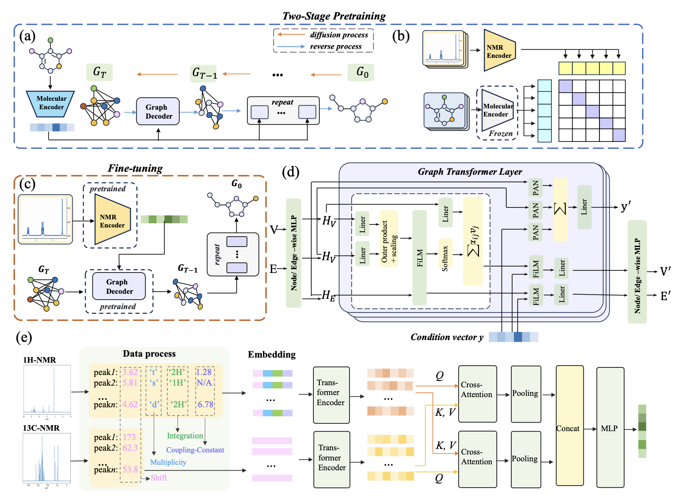

# DiffNMR

[DiffNMR: Diffusion Models for Nuclear Magnetic Resonance Spectra Elucidation](https://arxiv.org/abs/2507.08854)

## Abstract

Nuclear Magnetic Resonance (NMR) spectroscopy is a central characterization method
for molecular structure elucidation. DiffNMR formulates NMR-based structure
elucidation as conditional molecular graph generation and uses a discrete diffusion
model to iteratively refine molecular graphs from spectrum conditions.



---

## Model Description

### Overview

DiffNMR is an end-to-end molecular generation model for NMR spectrum
elucidation. Given tokenized `1H` and `13C` NMR signals, the model generates
candidate molecular graphs and evaluates generated molecules against the input
spectrum condition.

The framework contains:

- `NMRNetCLIP`: spectrum encoder for NMR representation learning
- `MolecularGraphFormer`: molecular graph encoder for graph representation learning
- `DiffNMR`: conditional discrete diffusion model for molecular graph generation

### Method

DiffNMR uses a two-stage pretraining and fine-tuning workflow:

1. Pretrain the molecular encoder and decoder with a diffusion autoencoder.
2. Pretrain the NMR spectrum encoder with contrastive learning.
3. Fine-tune the conditional diffusion model for spectrum-conditioned molecular
   graph generation.

During sampling, the model starts from noisy discrete graph features and denoises
them step by step under the NMR spectrum condition.

---

## Dataset Description

### MSD-NMR

MSD-NMR is a multimodal spectroscopic dataset for molecular structure
elucidation. PaddleMaterials uses the preprocessed CSV format with the following
columns:

- `smiles`: molecular SMILES
- `tokenized_input`: JSON string containing `1HNMR` and `13CNMR`
- `atom_count`: number of atoms for filtering and batching

| Dataset | Train | Val | Test | Total |
| --- | ---: | ---: | ---: | ---: |
| MSD-NMR n<15 | 109,358 | 6,076 | 6,075 | 121,509 |
| MSD-NMR n<20 | 235,512 | 13,085 | 13,084 | 261,681 |
| MSD-NMR n<25 | 351,273 | 19,516 | 19,515 | 390,304 |
| MSD-NMR n<35 | 517,319 | 28,741 | 28,739 | 574,799 |

### Data Preparation

Download the dataset and support files:

- [MSD-NMR dataset](https://paddle-org.bj.bcebos.com/paddlematerial/datasets/msd/msd_nmr.zip)
- [Vocabulary files](https://paddle-org.bj.bcebos.com/paddlematerials/assets/vocabs/msd_nmr_vocab.zip)
- [MSD-NMR n<15 retrieval database](https://paddle-org.bj.bcebos.com/paddlematerials/assets/databases/msd_nmr_nless15_retrieval_molecular_representations.zip)
- [MSD-NMR n<20 retrieval database](https://paddle-org.bj.bcebos.com/paddlematerials/assets/databases/msd_nmr_nless20_retrieval_molecular_representations.zip)

Place the files under the repository root and extract them:

```bash
mkdir -p data spectrum_elucidation
unzip msd_nmr.zip -d data
unzip msd_nmr_vocab.zip -d spectrum_elucidation
unzip msd_nmr_nless15_retrieval_molecular_representations.zip -d spectrum_elucidation
```

The default configs expect:

```text
data/MSD_nmr/train.csv
data/MSD_nmr/val.csv
data/MSD_nmr/test.csv
spectrum_elucidation/vocab/nless15/
spectrum_elucidation/retrieval_database/
```

For a quick sampling smoke test, a bundled one-row sample from the MSD-NMR n<15
validation split is provided at `example/sample.csv`.

---

## Results

| Model Name | Dataset | Loss | Negative Log Likelihood | GPUs | Training Time | Config | Checkpoint / Log |
| --- | --- | ---: | ---: | ---: | --- | --- | --- |
| diffnmr_diffgraphformer_msdnmr_nless15 | MSD-NMR n<15 | 1.946618 | 66.028621 | 4 | ~34.15 hours | [DiffNMR_DiffGraphFormer.yaml](DiffNMR_DiffGraphFormer.yaml) | - |
| diffnmr_nmrnet_msdnmr_nless15 | MSD-NMR n<15 | 3.217951 | - | 4 | ~6.5 hours | [DiffNMR_NMRNet.yaml](DiffNMR_NMRNet.yaml) | - |
| diffnmr_msdnmr_nless15 | MSD-NMR n<15 | 1.946618 | 66.028621 | 4 | ~30.24 hours | [DiffNMR.yaml](DiffNMR.yaml) | [checkpoint](https://paddle-org.bj.bcebos.com/paddlematerials/checkpoints/spectrum_elucidation/diffnmr/diffnmr_msdnmr_nless15.zip) |

---

## Command

### Training

```bash
# stage 1: pretrain molecular encoder and decoder
python -m paddle.distributed.launch --gpus="0,1,2,3" spectrum_elucidation/train.py -c spectrum_elucidation/configs/diffnmr/DiffNMR_DiffGraphFormer.yaml
python spectrum_elucidation/train.py -c spectrum_elucidation/configs/diffnmr/DiffNMR_DiffGraphFormer.yaml

# stage 2: pretrain NMR spectrum encoder
python -m paddle.distributed.launch --gpus="0,1,2,3" spectrum_elucidation/train.py -c spectrum_elucidation/configs/diffnmr/DiffNMR_NMRNet.yaml
python spectrum_elucidation/train.py -c spectrum_elucidation/configs/diffnmr/DiffNMR_NMRNet.yaml

# fine-tune DiffNMR
python -m paddle.distributed.launch --gpus="0,1,2,3" spectrum_elucidation/train.py -c spectrum_elucidation/configs/diffnmr/DiffNMR.yaml
python spectrum_elucidation/train.py -c spectrum_elucidation/configs/diffnmr/DiffNMR.yaml
```

### Validation

```bash
python spectrum_elucidation/train.py -c spectrum_elucidation/configs/diffnmr/DiffNMR.yaml Global.do_eval=True Global.do_train=False Global.do_test=False Trainer.pretrained_model_path='path/to/model.pdparams'
```

### Testing

```bash
python spectrum_elucidation/train.py -c spectrum_elucidation/configs/diffnmr/DiffNMR.yaml Global.do_eval=False Global.do_train=False Global.do_test=True Trainer.pretrained_model_path='path/to/model.pdparams'
```

### Sample

```bash
# This command is used to sample molecular structures conditioned on NMR spectra.
# Mode 1: Use a self-contained pre-trained model package.
# Mode 2: Use a custom configuration file with local checkpoints and vocabulary.
# Results are saved to the folder specified by --output_dir (default: results).

python spectrum_elucidation/sample.py --model_name='diffnmr_msdnmr_nless15' --weights_name='best.pdparams' --output_dir='result_diffnmr_sample/'
python spectrum_elucidation/sample.py --config_path='spectrum_elucidation/configs/diffnmr/DiffNMR.yaml' --checkpoint_path='./checkpoints' --weights_name='best.pdparams' --output_dir='result_diffnmr_sample/'

# By default, sampling uses the bundled one-row validation example.
# To sample the full test split, override:
# Sampler.data.dataset.__init_params__.path='./data/MSD_nmr/test.csv'
```

---

## Citation

```bibtex
@article{yang2025diffnmr,
  title={DiffNMR: Diffusion Models for Nuclear Magnetic Resonance Spectra Elucidation},
  author={Yang, Qingsong and Wu, Binglan and Liu, Xuwei and Chen, Bo and Li, Wei and Long, Gen and Chen, Xin and Xiao, Mingjun},
  journal={arXiv preprint arXiv:2507.08854},
  year={2025}
}
```
