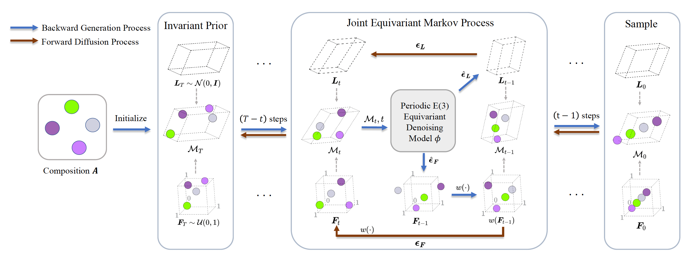

# DiffCSP

[Crystal Structure Prediction by Joint Equivariant Diffusion](https://arxiv.org/abs/2309.04475)

## Abstract

DiffCSP frames crystal structure prediction as a denoising diffusion process that jointly recovers lattice parameters and fractional atomic coordinates from noisy compositions. A SE(3)-equivariant score network respects rotational, translational, and permutation symmetries while handling periodic boundary conditions. Reverse-time sampling progressively removes noise to generate stable candidate structures, improving match rate and RMS displacement against ground-truth Materials Project crystals.



## Datasets:

DiffCSP is trained on composition–structure pairs, with CIF strings converted to primitive, Niggli-reduced cells before batching. Fractional coordinates and lattice matrices are extracted on the fly; no property targets beyond the crystal geometry are required.

- MP20:

    MP-20 selects 45,231 stable inorganic materials from the Materials Project (≤20 atoms per conventional cell). Structures containing Tc, Pm, or elements with atomic number ≥84 are removed, and high-energy samples (energy above hull >0.1 eV/atom) are filtered from the training pool; all structures are relaxed with a consistent PBE workflow to reduce label noise (see `ppmat.datasets.MP20Dataset` and `jointContribution/mattergen/data-release/mp-20/README.md` for details).

    During preprocessing, MP-20 CSV files are parsed into pymatgen `Structure` objects, optionally reduced to primitive/Niggli form, and then converted into arrays of lattice parameters, fractional coordinates, atom types, and per-structure atom counts (`num_atoms`). These arrays are the direct inputs to DiffCSP’s diffusion process and the `structure_generation/train.py` entry point. No property values (formation energy, band gap, etc.) are used by DiffCSP itself; evaluation is based purely on geometric recovery.

    |                                     Dataset                                      | train |  val  | test  |
    | :------------------------------------------------------------------------------: | :---: | :---: | :---: |
    | [MP20](https://paddle-org.bj.bcebos.com/paddlematerial/datasets/mp_20/mp_20.zip) | 27136 | 9047  | 9046  |

## Model

DiffCSP performs joint diffusion on two manifolds: (1) a wrapped Gaussian process over fractional coordinates inside the unit cell and (2) a Gaussian process over lattice matrices.

In the Paddle implementation (`ppmat.models.diffcsp.DiffCSP`), training proceeds as follows:

- given a clean structure array containing `lattice` (or lengths/angles), `frac_coords`, `atom_types`, and `num_atoms`, Gaussian noise is added separately to lattice matrices and fractional coordinates by two schedulers (`lattice_scheduler`, `coord_scheduler`), producing noisy inputs $(\tilde{L}, \tilde{X})$ and noise terms $(\epsilon_L, \epsilon_X)$;  
- a sinusoidal time embedding of the discrete diffusion step index is computed and passed, along with atom types, $\tilde{X}$, $\tilde{L}$, and `num_atoms`, into a decoder `CSPNet`, which is an SE(3)-equivariant graph neural network designed for crystal diffusion;  
- for lattice, the decoder directly predicts the noise $\hat{\epsilon}_L$, and an MSE loss against the sampled $\epsilon_L$ is used;  
- for coordinates, the decoder predicts a score corresponding to the wrapped normal log-density gradient; this score is matched against the analytically tractable target `d_log_p_wrapped_normal` derived from the coordinate noise and scheduler sigmas.

The coordinate scheduler maintains a table of discrete noise levels (`discrete_sigmas` and their normalized variants) so that DiffCSP can rescale both predictions and targets appropriately at each diffusion step. Atom types are kept fixed and treated as conditioning information only; DiffCSP predicts structures given composition rather than generating compositions.

At sampling time, DiffCSP initializes both lattice and fractional coordinates from simple priors (`l_T`, `x_T`) and uses the two schedulers to perform a predictor–corrector reverse-time integration:

1. a “corrector” step based on denoiser predictions refines the current sample at fixed noise level;  
2. a “predictor” step moves the sample to the next, lower noise level using the analytic reverse SDE/ODE update;  
3. coordinates are renormalized modulo 1.0 to keep atoms inside the unit cell.

After the final step, DiffCSP returns the denoised fractional coordinates $x_t$ and lattice matrices $L_t$ as the predicted crystal structures. Evaluation uses the match rate (percentage of generated structures matching the ground truth under a structure matcher) and RMS displacement between generated and reference structures, as reported in the original paper.


## Results

<table>
    <head>
        <tr>
            <th  nowrap="nowrap">Model</th>
            <th  nowrap="nowrap">Dataset</th>
            <th  nowrap="nowrap">Match Rate</th>
            <th  nowrap="nowrap">RMS Dist</th>
            <th  nowrap="nowrap">GPUs</th>
            <th  nowrap="nowrap">Training time</th>
            <th  nowrap="nowrap">Config</th>
            <th  nowrap="nowrap">Checkpoint | Log</th>
        </tr>
    </head>
    <body>
        <tr>
            <td  nowrap="nowrap">diffcsp_mp20</td>
            <td  nowrap="nowrap">mp20</td>
            <td  nowrap="nowrap">51.72</td>
            <td  nowrap="nowrap">0.0591</td>
            <td  nowrap="nowrap">1</td>
            <td  nowrap="nowrap">~13.5 hours</td>
            <td  nowrap="nowrap"><a href="diffcsp_mp20.yaml">diffcsp_mp20</a></td>
            <td  nowrap="nowrap"><a href="https://paddle-org.bj.bcebos.com/paddlematerial/checkpoints/structure_generation/diffcsp/diffcsp_mp20.zip">checkpoint | log</a></td>
        </tr>  
    </body>
</table>

### Training
```bash
# multi-gpu training, we use 4 gpus here
python -m paddle.distributed.launch --gpus="0,1,2,3" structure_generation/train.py -c structure_generation/configs/diffcsp/diffcsp_mp20.yaml
# single-gpu training
python structure_generation/train.py -c structure_generation/configs/diffcsp/diffcsp_mp20.yaml
```

### Validation
```bash
# Adjust program behavior on-the-fly using command-line parameters – this provides a convenient way to customize settings without modifying the configuration file directly.
# such as: --Global.do_eval=True
python structure_generation/train.py -c structure_generation/configs/diffcsp/diffcsp_mp20.yaml Global.do_eval=True Global.do_train=False Global.do_test=False Trainer.pretrained_model_path='your model path(*.pdparams)'
```

### Testing
```bash
# This command is used to evaluate the model's performance on the test dataset.
python structure_generation/train.py -c structure_generation/configs/diffcsp/diffcsp_mp20.yaml Global.do_eval=False Global.do_train=False Global.do_test=True Trainer.pretrained_model_path='your model path(*.pdparams)'
```

### Sample
```bash
# This command is used to predict the  crystal structure using a trained model.
# Note: The model_name and weights_name parameters are used to specify the pre-trained model and its corresponding weights. The chemical_formula parameter is used to specify the chemical formula of the crystal structure to be predicted.
# The prediction results will be saved in the folder specified by the `save_path` parameter, with the default set to `result`.

# Mode 1: Leverage a pre-trained machine learning model for crystal structure prediction. The implementation includes automated model download functionality, eliminating the need for manual configuration.
python structure_generation/sample.py --model_name='diffcsp_mp20' --weights_name='latest.pdparams' --save_path='result_diffcsp_mp20/' --chemical_formula="LiMnO2"

# Mode2: Use a custom configuration file and checkpoint for crystal structure prediction. This approach allows for more flexibility and customization.
python structure_generation/sample.py --config_path='structure_generation/configs/diffcsp/diffcsp_mp20.yaml' --checkpoint_path='./output/diffcsp_mp20/checkpoints/latest.pdparams' --save_path='result_diffcsp_mp20/' --chemical_formula="LiMnO2"
```

## Citation
```
@article{jiao2023crystal,
  title={Crystal structure prediction by joint equivariant diffusion},
  author={Jiao, Rui and Huang, Wenbing and Lin, Peijia and Han, Jiaqi and Chen, Pin and Lu, Yutong and Liu, Yang},
  journal={arXiv preprint arXiv:2309.04475},
  year={2023}
}
```
